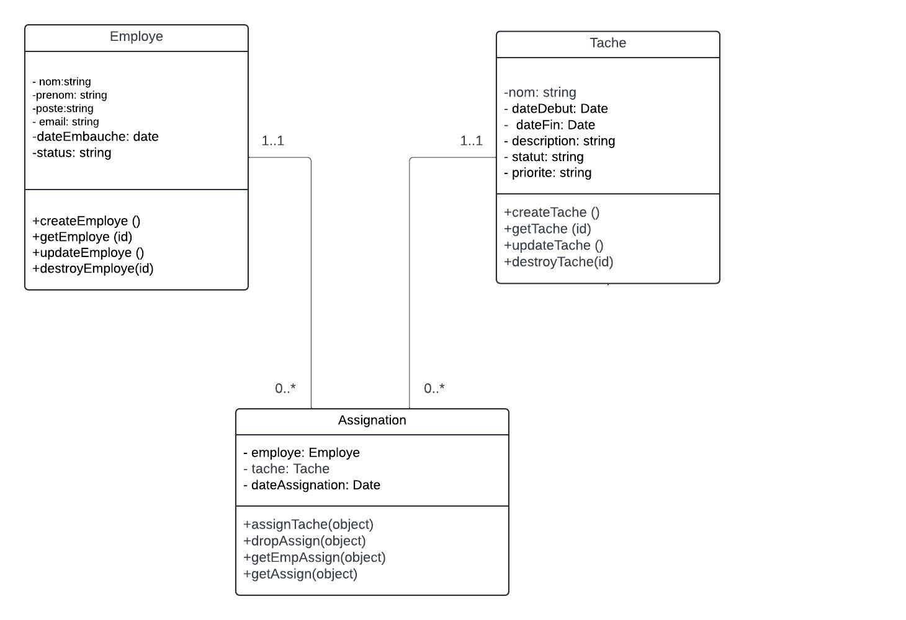

## Gestion de Projet - Composants Métiers

Ce projet consiste en la modélisation et l'implémentation de composants métiers pour la gestion des employés, des tâches et des assignations dans une application de gestion de projet. Chaque composant permet d'effectuer des opérations CRUD (Créer, Lire, Mettre à jour, Supprimer) et d'assurer la gestion des relations entre employés et tâches.

### Aperçu

Le projet est divisé en trois composants principaux :
1. **Gestion des employés** : Permet la gestion des employés de l'application.
2. **Gestion des tâches** : Permet la gestion des tâches assignées aux employés.
3. **Gestion des assignations** : Permet l'assignation et le retrait de tâches aux employés.

### Diagrammes de Classes

Les diagrammes de classes illustrent la structure des entités et leurs méthodes pour chaque composant métier :

- **Diagramme de la classe `Employe`** : Contient les attributs et méthodes liés à la gestion des employés.
- **Diagramme de la classe `Tache`** : Contient les attributs et méthodes liés à la gestion des tâches.
- **Diagramme de la classe `Assignation`** : Contient les attributs et méthodes liés à l'assignation et au retrait des tâches.

### Prérequis
Avant de commencer, assurez-vous d'avoir les éléments suivants installés sur votre machine :

- Node.js (version 14 ou supérieure) : Utilisé pour exécuter le projet JavaScript. Télécharger Node.js
- npm (Gestionnaire de paquets de Node.js) : Généralement inclus avec Node.js, utilisé pour installer les dépendances.
- Git : Utilisé pour cloner le dépôt et gérer le contrôle de version. Télécharger Git

### Optionnel :
- Postman (ou tout autre outil de requête API) : Pour tester les API si nécessaire. Télécharger Postman

### Installation
Pour installer et exécuter le projet, suivez ces étapes :

### Clonez le dépôt
git clone ````https://github.com/OUMARNDIAYE49/gestion-projet-express.git````

### Naviguez dans le répertoire du projet
cd ```gestion-projet-express```

### Installez les dépendances (si nécessaire)
- initialisé ```git init```
- Express ```npm install express```
- body-parser ```npm install body-parser```
- nodemon ```npm install nodemon```

### UTilisation
Pour démarrer l'application, exécutez la commande suivante 
 ```npm start ```

### Diagramme de  Classe




### Authors
[Oumar Djiby Ndiaye ](https://github.com/OUMARNDIAYE49/gestion-projet-express.git)